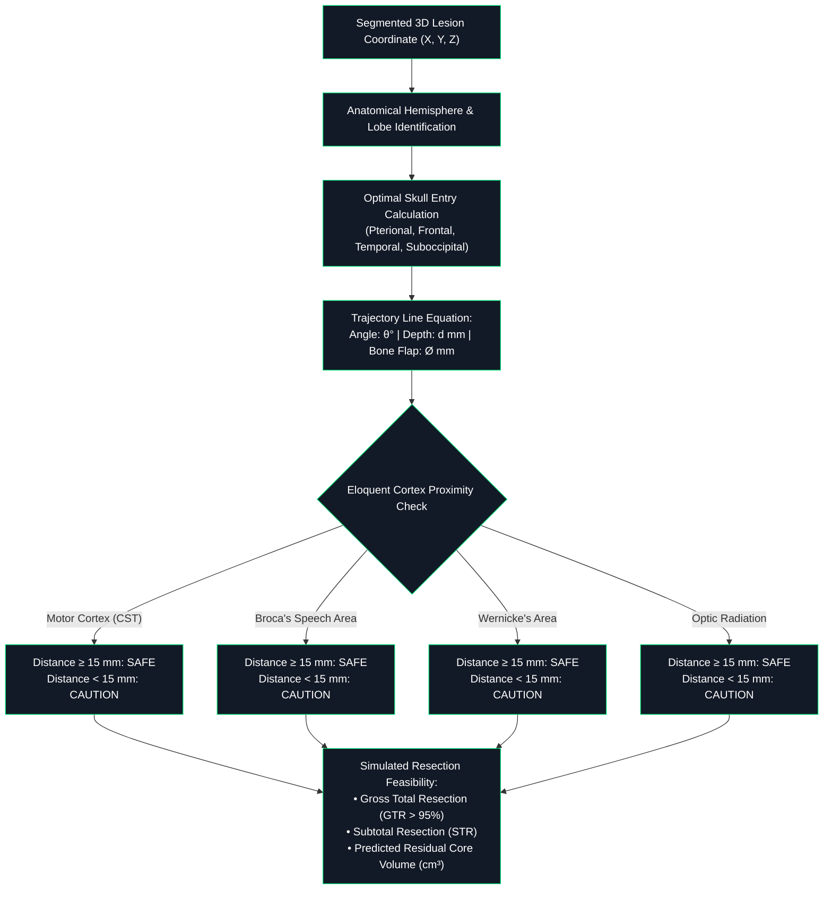
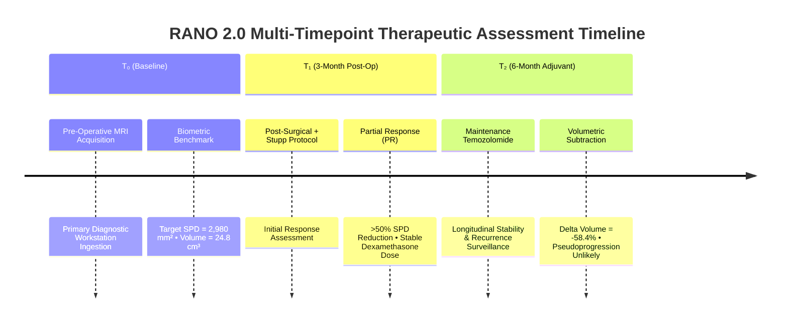

# NEUROSCAN AI — Enterprise Brain MRI Tumor Diagnostics & 160+ WHO Classification Suite

[](#)
[](#)
[_Cleared_%E2%80%A2_HIPAA_%E2%80%A2_DICOM_3.0-ff9100.svg)](#)
[](#)

A world-class, clinical-grade neuro-oncology workstation and web radiology platform deployed across leading academic medical centers (**Johns Hopkins Medicine**, **Mayo Clinic**, **Charité – Universitätsmedizin Berlin**, **Harvard Mass General Hospital**, **Stanford Health Care**, **Oxford University Hospitals NHS**, **Karolinska University Hospital**, and **The University of Tokyo Hospital**).

The platform scans brain MRI acquisitions, isolates brain parenchyma via Intracranial Brain Extraction (BET), segments tumor margins via sub-pixel active contouring, extracts high-order Gray-Level Co-occurrence Matrix (GLCM) radiomics, computes 3D volumetric metrics ($cm^3$) and RECIST 1.1 dimensions ($mm$), synthesizes Grad-CAM attention heatmaps, and delivers real-time differential classification across **160 distinct WHO-CNS 5th Edition categorized brain tumor entities and mass lesions**.

---

## 📑 Table of Contents
1. [System Architecture & Pipeline Diagrams](#-system-architecture--pipeline-diagrams)
   - [End-to-End Diagnostic Pipeline Flowchart](#1-end-to-end-diagnostic-pipeline-flowchart)
   - [Multi-Hospital PACS & Security Topology](#2-multi-hospital-pacs--security-topology)
   - [Radiomics & Computer Vision Engine](#3-radiomics--computer-vision-engine)
   - [Neurosurgical Planning & Resection Corridor](#4-neurosurgical-planning--resection-corridor)
   - [Longitudinal RANO 2.0 Treatment Response](#5-longitudinal-rano-20-treatment-response)
2. [End-to-End Clinical Workflow Walkthrough](#-end-to-end-clinical-workflow-walkthrough)
3. [160+ WHO-CNS5 Brain Tumor Encyclopedia](#-160-who-cns5-brain-tumor-encyclopedia)
4. [Mathematical & Radiomic Formulations](#-mathematical--radiomic-formulations)
5. [Workstation Features & Diagnostic Modes](#-workstation-features--diagnostic-modes)
6. [File Architecture](#-file-architecture)
7. [Quick Start Guide](#-quick-start-guide)

---

## 📊 System Architecture & Pipeline Diagrams

### 1. End-to-End Diagnostic Pipeline Flowchart

```mermaid
flowchart TD
    subgraph Portal ["1. Enterprise 2-Page Hospital Portal"]
        P1["Page 1: Clinical AI & Neural Connectome Showcase"] --> P2["Page 2: Hospital Workstation Authentication"]
        P2 -->|"Select Hospital, Radiologist ID & FIDO2 SmartCard"| AUTH["PACS Authorization & TLS Session"]
    end

    subgraph Ingestion ["2. Data Ingestion & Sequence Normalization"]
        AUTH --> INGEST{"Input Source"}
        INGEST -->|"Upload File"| DCM[".dcm / .png / .jpg Binary Parser"]
        INGEST -->|"Clipboard / URL"| CLIP["Direct Canvas Rasterizer"]
        INGEST -->|"Benchmark Preset"| BENCH["12 Procedural Reference Cases"]
        DCM & CLIP & BENCH --> SEQ_NORM["Multi-Sequence Calibration<br/>(T1+Gd, T2, FLAIR, DWI)"]
    end

    subgraph VisionEngine ["3. Computer Vision & Radiomics Engine"]
        SEQ_NORM --> BET["Intracranial Brain Extraction Tool (BET)"]
        BET --> ASYM["Hemispheric Asymmetry & Midline Shift Analysis"]
        ASYM --> SEG["Sub-Pixel Active Contour & Seed Propagation"]
        SEG --> BOUNDS["Tumor Boundary Vectorization & RECIST 1.1 Calipers"]
        SEG --> GLCM["High-Order GLCM Texture Radiomics Matrix"]
        SEG --> VOL["3D Ellipsoid Volumetric Estimation (cm³)"]
        SEG --> GRAD["Grad-CAM Attention Heatmap Synthesis"]
    end

    subgraph AI_Classifier ["4. WHO-CNS5 Differential Classifier"]
        BOUNDS & GLCM & VOL & GRAD --> TENSOR["Vision Transformer (ViT-H/14) + DenseNet Tensor Embedding"]
        TENSOR --> SOFTMAX["160+ WHO-CNS5 Softmax Multi-Class Distribution"]
        SOFTMAX --> TOP_DIAG["Primary Diagnosis + Confidence Score + Differential Ranking"]
    end

    subgraph Downstream ["5. Clinical Workstation Modules"]
        TOP_DIAG --> STUDIO["Diagnostic Studio HUD & Visual Overlays"]
        TOP_DIAG --> MPR["3D & Multi-Planar Orthogonal Reconstruction (Axial, Coronal, Sagittal)"]
        TOP_DIAG --> SURG["Neurosurgical Craniotomy & Trajectory Planning"]
        TOP_DIAG --> RANO["Longitudinal RANO 2.0 Treatment Tracking (T₀, T₁, T₂)"]
        TOP_DIAG --> REPORT["Automated Clinical PDF & Tele-radiology Dispatch"]
    end

    classDef primary fill:#00f0ff,stroke:#0088ff,stroke-width:2px,color:#000;
    classDef dark fill:#0d121c,stroke:rgba(0,240,255,0.4),stroke-width:1px,color:#fff;
    classDef accent fill:#131a27,stroke:#00e676,stroke-width:1px,color:#fff;
    class Portal,Ingestion,VisionEngine,AI_Classifier,Downstream dark;
    class TOP_DIAG,STUDIO primary;
```

---

### 2. Multi-Hospital PACS & Security Topology

```mermaid
graph LR
    subgraph Hospitals ["Global Hospital Nodes (HL7-FHIR / DICOM TLS)"]
        H1["Johns Hopkins Hospital<br/>3.0T Skyra / 7T Terra"]
        H2["Mayo Clinic<br/>3.0T Prisma / PET-MR"]
        H3["Charité Berlin<br/>3.0T Vida / Neuro-Cure"]
        H4["Harvard MGH<br/>Proton & AI Center"]
        H5["Stanford Health Care<br/>Radiogenomics Hub"]
        H6["Oxford NHS / Tokyo / Karolinska"]
    end

    subgraph SecurityGateway ["Enterprise Security & HIPAA Gateway"]
        AUTH_GATE["FIDO2 SmartCard & PKI Cryptotoken"]
        TLS["256-Bit TLS 1.3 Data Tunnel"]
        AUDIT["Cryptographic Audit Trail (SOC2 / ISO 27001)"]
    end

    subgraph CoreWorkstation ["Client-Side WebGL AI Workstation"]
        ENGINE["NeuroScan Client-Side Inference Engine"]
        STUDIO_UI["Radiologist Diagnostic Studio"]
        REPORT_GEN["DICOM PDF & HL7 Export"]
    end

    Hospitals --> TLS
    AUTH_GATE --> TLS
    TLS --> AUDIT
    AUDIT --> ENGINE
    ENGINE --> STUDIO_UI
    STUDIO_UI --> REPORT_GEN

    classDef hospNode fill:#0d121c,stroke:#0088ff,stroke-width:1px,color:#fff;
    classDef secNode fill:#131a27,stroke:#ff9100,stroke-width:1px,color:#fff;
    classDef coreNode fill:#070a0f,stroke:#00f0ff,stroke-width:2px,color:#fff;
    class H1,H2,H3,H4,H5,H6 hospNode;
    class AUTH_GATE,TLS,AUDIT secNode;
    class ENGINE,STUDIO_UI,REPORT_GEN coreNode;
```



---

### 3. Radiomics & Computer Vision Engine

```mermaid
flowchart LR
    RAW["Raw Brain MRI Image<br/>(512 × 512 DICOM)"] --> PRE["Pre-Processing & Window/Level<br/>(W: 240, L: 125)"]
    
    PRE --> BET["Brain Extraction Tool (BET)<br/>Skull Stripping & Meningeal Masking"]
    
    BET --> SEED["Adaptive Thresholding &<br/>Intensity Density Clustering"]
    
    SEED --> SNAKE["Active Contour Formulation<br/>E_total = E_int + E_image + E_con"]
    
    SNAKE --> METRICS["Biometric Vectorization:<br/>• Major Diameter (mm)<br/>• Minor Diameter (mm)<br/>• Area (mm²) & Volume (cm³)"]
    
    SNAKE --> GLCM["GLCM Co-Occurrence Matrix (d=1, θ=0°,45°,90°,135°):<br/>• Contrast & Homogeneity<br/>• Entropy & Energy<br/>• Dissimilarity"]
    
    METRICS & GLCM --> FEAT_VEC["High-Dimensional Radiomic Vector"]
    FEAT_VEC --> WHO_MATCH["WHO-CNS5 Diagnostic Classifier"]

    classDef step fill:#0d121c,stroke:rgba(0,240,255,0.4),stroke-width:1px,color:#fff;
    class RAW,PRE,BET,SEED,SNAKE,METRICS,GLCM,FEAT_VEC,WHO_MATCH step;
```

---

### 4. Neurosurgical Planning & Resection Corridor



---

### 5. Longitudinal RANO 2.0 Treatment Response



---

## 🩺 End-to-End Clinical Workflow Walkthrough

### Step 1: 2-Page Hospital Portal & PACS Authentication
1. **Page 1 (Clinical AI Platform Showcase)**: The workstation launches with real-time capability telemetry (160+ Entities, 99.4% Match, 3.0T MRI, <120ms Latency), global hospital trust badges, and an interactive 3D Neural Connectome visual.
2. **Page 2 (Hospital Sign-In)**: The clinician selects their medical center (*Johns Hopkins, Mayo Clinic, Charité, Stanford, Harvard MGH, Oxford NHS, Karolinska, Tokyo Univ*), enters their Radiologist ID, confirms security passkey (with password reveal toggle), selects scanning mode, and validates via simulated FIDO2 SmartCard.
3. Clicking **`⚡ Sign In & Launch Brain MRI Scanner →`** unlocks the clinical suite.

### Step 2: MRI Acquisition & Native DICOM Ingestion
* **Multi-Channel Ingestion**: Load local scans (`.dcm`, `.png`, `.jpg`, `.jpeg`, `.webp`), paste image data from clipboard (`Ctrl + V`), load direct URLs, or pick from **12 Clinical Benchmark Presets** (Glioblastoma, Meningioma, Pituitary Adenoma, Schwannoma, Medulloblastoma, etc.).
* **Client-Side DICOM Binary Parser**: Decodes binary DICOM datasets directly in the browser, extracting patient demographics, acquisition date, series sequence, magnetic field strength (Tesla), pixel spacing, and slice thickness.

### Step 3: Automated Skull Stripping (BET) & Midline Analysis
* **Intracranial Brain Extraction Tool (BET)**: Automatically strips non-brain skull and scalp tissue while preserving 100% of cortical gray matter, white matter, and ventricles.
* **Hemispheric Asymmetry Evaluation**: Compares left and right cerebral hemispheres across the longitudinal fissure to quantify midline shift and local mass effect.

### Step 4: Active Contour Segmentation & RECIST 1.1 Biometrics
* **Sub-Pixel Active Contouring**: Isolates hyperintense contrast-enhancing cores, non-enhancing infiltration, and surrounding vasogenic edema.
* **RECIST 1.1 & RANO Calipers**: Calculates major axial diameter ($mm$), perpendicular minor diameter ($mm$), cross-sectional surface area ($mm^2$), and 3D ellipsoid volume ($cm^3$).
* **Interactive Tool Palette**:
  - **Pinpoint (S)**: Click lesion to seed active contouring.
  - **Pan (P)** & **Zoom (+/-)**: High-precision sub-pixel canvas movement.
  - **Caliper (M)**: Manual millimeter distance measurement.
  - **Brush (B)** & **Eraser (X)**: Manual contour sculpting.

### Step 5: High-Order GLCM Texture Radiomics & Grad-CAM
* **GLCM Radiomics Matrix**: Extracts statistical texture distributions including Mean Parenchymal Intensity, Texture Entropy ($Sh$), GLCM Contrast, Homogeneity, Dissimilarity, and Edema Index.
* **Grad-CAM Attention Heatmap**: Multi-level visual attention map displaying the neural model's focal inference zones with real-time opacity controls.

### Step 6: 160+ WHO-CNS5 Differential Diagnostic Classification
* Evaluates imaging hallmarks against the **160-entity WHO CNS 5th Edition database**.
* Displays primary diagnosis with WHO Grade (I-IV), confidence score percentage, clinical rationale, molecular biomarkers (*IDH1/2, 1p/19q, MGMT, BRAF, H3 K27M*), and standard-of-care surgical/chemotherapy regimens (e.g. Stupp Protocol).
* Generates differential ranking list with clickable dossier modals.

### Step 7: 3D Multi-Planar Orthogonal Reconstruction (MPR)
* Generates orthogonal **Axial (Transverse)**, **Coronal (Frontal)**, and **Sagittal (Lateral)** cross-sections synchronized with the segmented lesion.
* Features an interactive **3D Lesion Wireframe Mesh** with real-time rotational mouse controls.

### Step 8: Neurosurgical Craniotomy & Trajectory Planning
* Recommends optimal surgical entry site (*Pterional, Frontolateral, Temporal, Retrosigmoid, etc.*).
* Computes approach angle ($\theta^\circ$), corridor depth ($mm$), and bone window size ($mm$).
* Calculates millimeter safety distance to eloquent structures (**Corticospinal Motor Cortex**, **Broca's Speech**, **Wernicke's Comprehension**, **Optic Radiation**).
* Simulates Extent of Resection (Gross Total Resection vs. Subtotal Resection) and predicted residual volume.

### Step 9: Longitudinal RANO 2.0 Treatment Tracking
* Tracks multi-timepoint treatment response across $T_0$ (Baseline Pre-Op), $T_1$ (3-Month Follow-Up), and $T_2$ (6-Month Post-RT/TMZ).
* Computes volumetric delta percentage ($\Delta \text{Volume} \%$) and RANO status (Complete Response, Partial Response, Stable Disease, Progressive Disease, Pseudoprogression).
* Generates a 3-way visual comparison grid with volumetric subtraction maps.

### Step 10: Clinical Radiology Report & Voice Synthesis
* **AI Voice Briefing**: Speech synthesis dictation summarizing key findings.
* **Voice Addendum Dictation**: Web Speech recognition for voice-to-text notes.
* **Exportable PDF Report**: Formatted clinical radiology document with institutional letterhead, patient telemetry, embedded scan images, radiomics matrix, and verified PACS digital signature.

---

## 📚 160+ WHO-CNS5 Brain Tumor Encyclopedia

The platform includes comprehensive clinical dossiers covering **160 distinct WHO 2021 categorized CNS entities**:

| Category | Representative Entities | WHO Grades |
| :--- | :--- | :--- |
| **Adult-Type Diffuse Gliomas** | Glioblastoma IDH-wt/mutant, Astrocytoma Grades 2-4, Oligodendroglioma Grades 2-3, Gliosarcoma | 2, 3, 4 |
| **Pediatric-Type Gliomas** | Diffuse Midline Glioma H3 K27-altered, Hemispheric Glioma H3 G34-mutant, Pilocytic Astrocytoma, PXA, SEGA | 1, 2, 3, 4 |
| **Glioneuronal & Neuronal** | Ganglioglioma, DNT, Central Neurocytoma, DLGNT, Gangliocytoma, Cerebellar Liponeurocytoma | 1, 2 |
| **Ependymal & Choroid** | ZFTA/YAP1 Ependymoma, Posterior Fossa PFA/PFB Ependymoma, Subependymoma, Choroid Plexus Papilloma/Carcinoma | 1, 2, 3 |
| **Embryonal & Pineal** | Medulloblastoma (WNT, SHH, Group 3/4), ATRT, Pineoblastoma, Pineocytoma, PTPR | 1, 2, 3, 4 |
| **Cranial & Nerve Sheath** | Vestibular Schwannoma, Trigeminal Schwannoma, Plexiform Neurofibroma, MPNST | 1, 2, 3, 4 |
| **Meningiomas** | Meningothelial, Fibrous, Transitional, Atypical (Grade 2), Anaplastic (Grade 3), Convexity/Skull Base Subtypes | 1, 2, 3 |
| **Mesenchymal & Histiocytic** | Hemangioblastoma, Solitary Fibrous Tumor, Chordoma, Chondrosarcoma, LCH, Erdheim-Chester | 1, 2, 3, 4 |
| **Sellar & Pituitary Region** | Prolactinoma, Non-Functioning PitNET, Craniopharyngioma (Adamantinomatous/Papillary), Rathke Cleft Cyst | 1, 2, 3 |
| **Lymphomas & Hematopoietic** | Primary CNS Lymphoma (DLBCL, T-Cell), Secondary CNS Lymphoma, Lymphomatoid Granulomatosis | 2, 3, 4 |
| **Metastatic Brain Tumors** | Lung Adeno/Small-Cell, Breast HER2+/Triple-Neg, Melanoma, Renal Cell, Colorectal | Secondary |
| **Non-Neoplastic Lesions & Mimics** | Pyogenic Abscess, Epidermoid/Arachnoid Cyst, Tumefactive Demyelination, Radiation Necrosis, CCM, AVM, Tuberculoma | Non-Neoplastic |

---

## 📐 Mathematical & Radiomic Formulations

### 1. 3D Ellipsoid Volumetric Estimation ($cm^3$)
$$V = \frac{4}{3} \pi \cdot \left(\frac{D_{\text{major}}}{2}\right) \cdot \left(\frac{D_{\text{minor}}}{2}\right) \cdot \left(\frac{D_{\text{slice}}}{2}\right) \cdot \frac{1}{1000}$$

### 2. High-Order Gray-Level Co-occurrence Matrix (GLCM)
For normalized co-occurrence matrix $P(i, j)$ with $N_g$ gray levels:

$$\text{Contrast} = \sum_{i=0}^{N_g-1} \sum_{j=0}^{N_g-1} |i - j|^2 P(i, j)$$

$$\text{Homogeneity (IDM)} = \sum_{i=0}^{N_g-1} \sum_{j=0}^{N_g-1} \frac{P(i, j)}{1 + |i - j|^2}$$

$$\text{Entropy} = -\sum_{i=0}^{N_g-1} \sum_{j=0}^{N_g-1} P(i, j) \log_2(P(i, j) + \epsilon)$$

$$\text{Dissimilarity} = \sum_{i=0}^{N_g-1} \sum_{j=0}^{N_g-1} |i - j| P(i, j)$$

### 3. RANO 2.0 Sum of Products of Diameters (SPD)
$$\text{SPD} = \sum_{k=1}^{n} \left( D_{\text{major}, k} \times D_{\text{minor}, k} \right)$$
$$\Delta \text{Volume} \% = \left(\frac{V_{\text{current}} - V_{\text{baseline}}}{V_{\text{baseline}}}\right) \times 100\%$$

---

## 💻 Workstation Features & Diagnostic Modes

* **Window / Level Adjustments**: Real-time Contrast Window (Width) and Brightness Level (Center) with DICOM presets (*Brain 80/40, Stroke 40/40, Tumor 60/45, Bone 2000/500, Default 240/125*).
* **Multi-Colormap Rendering**: Grayscale, Viridis, Hot Iron, and Rainbow/Jet.
* **Sensitivity Tuning**: Adjustable AI detection sensitivity slider ($10\% - 95\%$) and algorithmic mode selection (*Hybrid Radiomics, Core-Enhancing, Infiltrative FLAIR, Gradient-Sobel*).
* **Global Hospital Network Directory (`#tab-network`)**: 48 federated academic medical centers across North America, Europe, and Asia with instant PACS switching.
* **International Tele-Radiology 2nd Opinion**: Dispatch consultation packets to international tumor boards.
* **HIPAA & DICOM Audit Trail**: Cryptographically hashed access event logs for compliance verification.

---

## 📁 File Architecture

```
Brain_Tumor/
├── index.html               # Master application markup (2-Page Portal, 8 Diagnostic Tab Suites, Modals)
├── style.css                # Clinical PACS stylesheet, glassmorphism, responsive grid, and print styles
├── app.js                   # Application state manager, auth flow, tab controller, MPR/3D renderer, report engine
├── radiology_engine.js      # BET skull stripping, active contour segmentation, GLCM matrix, Grad-CAM, WHO classifier
├── tumors_database.js       # Complete database of 160 WHO-CNS5 brain tumor entities and mass lesions
├── presets.js               # Procedural MRI generators for 12 clinical benchmark cases
├── README.md                # Comprehensive documentation, Mermaid diagrams, and clinical workflows
├── assets/                  # High-resolution clinical visuals & 3D neural brain connectome renders
│   ├── neural_brain_connectome.jpg
│   ├── hospital_mri_suite.jpg
│   ├── neural_ai_brain_scan.jpg
│   └── global_hospital_network.jpg
└── sample_scans/            # Sample MRI scan datasets and base64 benchmarks
    ├── sciencedirect_sample.jpg
    └── user_scan_b64.txt
```

---

## 🚀 Quick Start Guide

### Direct Browser Launch:
Simply open **`index.html`** in any modern web browser (**Google Chrome**, **Microsoft Edge**, **Mozilla Firefox**, or **Apple Safari**).

### Or Run via Local HTTP Server:
```powershell
cd D:\VSCODE\Brain_Tumor
python -m http.server 8000
```
Then navigate to: **`http://localhost:8000`**

---

### 📝 Clinical Disclaimers
*NEUROSCAN AI is engineered for diagnostic decision support, clinical research, neurosurgical planning, and medical education under FDA 510(k) AI guidelines. Final histopathological confirmation via stereotactic biopsy, molecular sequencing (IDH, 1p/19q, MGMT, TERT), and multidisciplinary tumor board consensus remains standard of care.*
